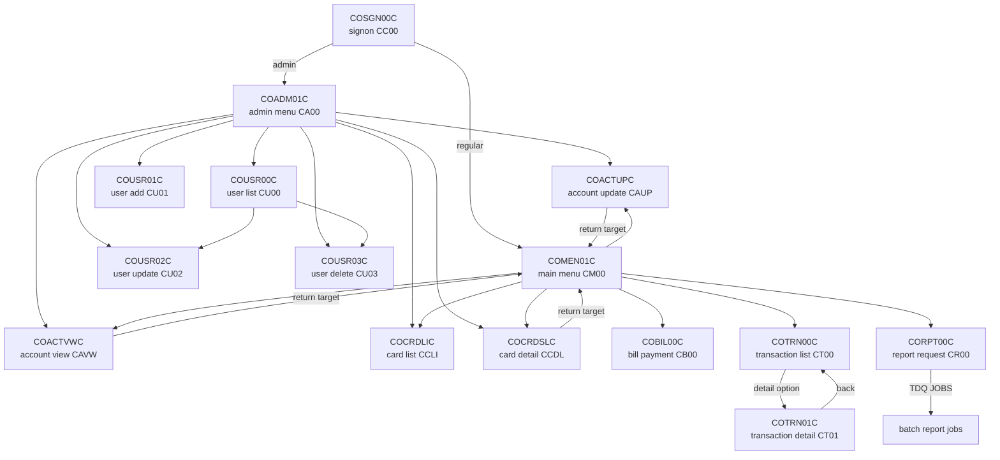
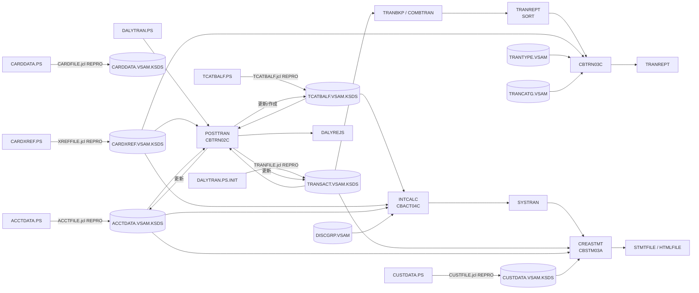

# 呼び出し・データフロー

## CICS 画面遷移

ソース中の `EXEC CICS XCTL` と、`CDEMO-TO-PROGRAM` /
`CDEMO-MENU-OPT-PGMNAME` に設定するリテラルを基にした図です。動的な
メニュー選択は候補を一つのノードにまとめています。`RETURN` は CICS
transaction を再開するための制御であり、下図の XCTL エッジとは区別
しています。

`COACTUPC`、`COACTVWC`、`COCRDSLC`、`COCRDUPC` などは
`CDEMO-FROM-PROGRAM` または `CDEMO-TO-PROGRAM` を使って呼出元へ戻る
ため、実行時の遷移先は画面操作で変わります。`COSGN00C` はソース中で
`COADM01C` または `COMEN01C` を明示的に XCTL します。CICS transaction
と program の対応は `app/csd/CARDDEMO.CSD` の定義に従っています。

## バッチとデータセット

初期データを indexed VSAM にロードする JCL、日次 posting、後続処理の
関係です。IDCAMS の `REPRO` は図では `load` と表記しています。

`TRANREPT.jcl` は `TRANSACT.VSAM.KSDS` をバックアップし SORT した後、
`CBTRN03C` を実行します。`CREASTMT.JCL` は SORT/IDCAMS の前処理後に
`CBSTM03A` を実行し、プログラム内で `CBSTM03B` を CALL します。
