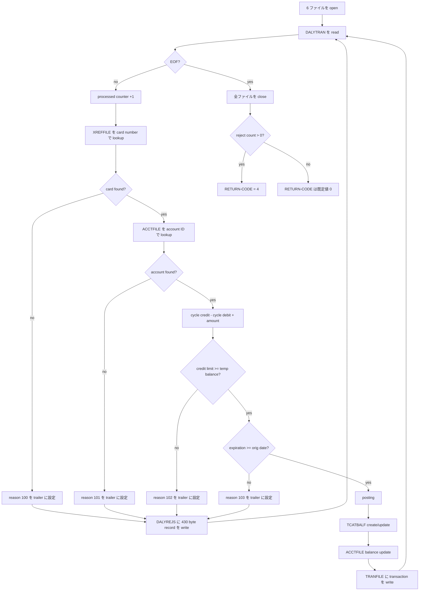

# CBTRN02C 日次取引 posting 設計

## 役割とファイル

ソースヘッダーは本プログラムを “Post the records from daily transaction
file” と説明しています。`POSTTRAN.jcl` の STEP15 から実行されます。

| DD / logical name | COBOL organization | 用途 |
|---|---|---|
| `DALYTRAN` | sequential, 350 bytes | daily transaction input |
| `TRANFILE` | indexed random, key `TRAN-ID` (X(16)) | posted transaction master |
| `XREFFILE` | indexed random, key card number X(16) | card→customer/account lookup |
| `DALYREJS` | sequential, 430 bytes | 350-byte input + 80-byte validation trailer |
| `ACCTFILE` | indexed random, key account ID 9(11) | account balances |
| `TCATBALF` | indexed random, key account ID + type + category (17 bytes) | category balances |

開始時に DALYTRAN/TRANFILE/XREFFILE/DALYREJS/ACCTFILE/TCATBALF を順に
open します。TRANFILE は `OPEN OUTPUT` で開始するため、ソースの実行では
既存の transaction file を作り直します。ACCTFILE と TCATBALF は `OPEN I-O`
です。

## 1 transaction の処理



## Validation

`1500-VALIDATE-TRAN` は XREF lookup が成功したときだけ account lookup を
実行します。account lookup 後は次の検査をソースの順番で実行します。

| reason | 条件 | trailer description |
|---:|---|---|
| 100 | card number が XREFFILE の key にない | `INVALID CARD NUMBER FOUND` |
| 101 | XREF が示す account ID が ACCTFILE にない | `ACCOUNT RECORD NOT FOUND` |
| 102 | `ACCT-CREDIT-LIMIT < ACCT-CURR-CYC-CREDIT - ACCT-CURR-CYC-DEBIT + DALYTRAN-AMT` | `OVERLIMIT TRANSACTION` |
| 103 | `ACCT-EXPIRAION-DATE < DALYTRAN-ORIG-TS (1:10)` | `TRANSACTION RECEIVED AFTER ACCT EXPIRATION` |
| 109 | account record の `REWRITE` が INVALID KEY | `ACCOUNT RECORD NOT FOUND` |

100–103 は validation failure として reject record を出力します。102 と
103 の条件は独立した `IF` であるため、同一入力が両条件を満たした場合は
後段の 103 が reason field を上書きします。109 は
`2800-UPDATE-ACCOUNT-REC` の REWRITE error handler で設定されますが、
ソース上この後に reject writer を呼ぶ分岐はありません。したがって 109 は
定義された診断コードであり、通常の 100–103 と同じ reject 出力経路に入る
ことはソースから確認できません。

## Posting

validation 成功後、2000 paragraph は daily record の ID/type/category/source/
description/amount/merchant/card/original timestamp を `TRAN-RECORD` に
移します。`FUNCTION CURRENT-DATE` で
`YYYY-MM-DD-HH.MM.SS.MIL0000` 形式の 26-byte processing timestamp を生成し、
`TRAN-PROC-TS` に設定します（layout 上の 0-based offset は 304、length は
26）。

1. **TCATBALF**: XREF の account ID、daily の type/category を 17-byte key
   として READ します。status 23（not found）の場合は新規 record を
   initialize し、key を設定し、`TRAN-CAT-BAL += DALYTRAN-AMT` して WRITE
   します。既存なら同じ加算をして REWRITE します。
2. **ACCTFILE**: `ACCT-CURR-BAL += DALYTRAN-AMT`。amount が 0 以上なら
   `ACCT-CURR-CYC-CREDIT`、負なら `ACCT-CURR-CYC-DEBIT` に amount を加算
   し、account record を REWRITE します。
3. **TRANFILE**: 完成した `TRAN-RECORD` を transaction ID key で WRITE
   します。

各 open/read/write/rewrite/close の file status が正常でない場合、IO status
を表示して `9999-ABEND-PROGRAM` に入り、`CEE3ABD` を `ABCODE=999`、
`TIMING=0` で CALL します。

## Return code とベースライン

通常完了後に processed/rejected を DISPLAY し、reject count が 0 より大きい
場合だけ `RETURN-CODE` を 4 に設定します。reject がない場合はこの箇所で
明示的な 0 設定をしません。GnuCOBOL ベースラインは次の通りです。

| 項目 | 結果 |
|---|---:|
| processed | 300 |
| rejected | 38 |
| return code | 4 |
| reason 0100 / 100 | 0 |
| reason 0101 / 101 | 0 |
| reason 0102 / 102 | 38 |
| reason 0103 / 103 | 0 |
| reason 0109 / 109 | 0 |
| reject file | 38 × 430 bytes = 16,340 bytes |
| post-run TRANFILE | 262 records |
| post-run ACCTFILE | 50 records |
| post-run TCATBALF | 100 records |

再現用の GnuCOBOL ベースライン harness は `modernization/cobol-baseline/`
（`run_baseline.sh`）にあります。Compiler は
`cobc (GnuCOBOL) 3.1.2.0`、compile command は次の通りです。

```bash
cobc -x -I app/cpy -fsign=EBCDIC -o build/CBTRN02C app/cbl/CBTRN02C.cbl
```

実行時は `DD_DALYTRAN`、`DD_TRANFILE`、`DD_XREFFILE`、`DD_DALYREJS`、
`DD_ACCTFILE`、`DD_TCATBALF` を各 indexed/sequential artifact に設定
します。固定長 daily input は改行を除去した 105,000-byte file
（300 × 350）です。`TRAN-PROC-TS` は CURRENT-DATE のため、実行のたびに
変わります。
